# CommerceCraft Architecture

## System Architecture Overview

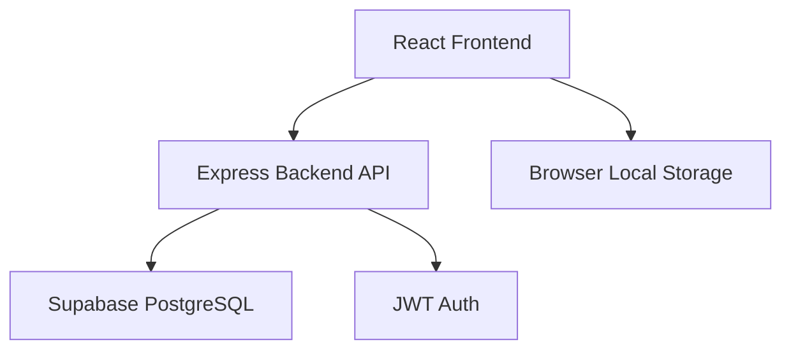

## Backend Architecture

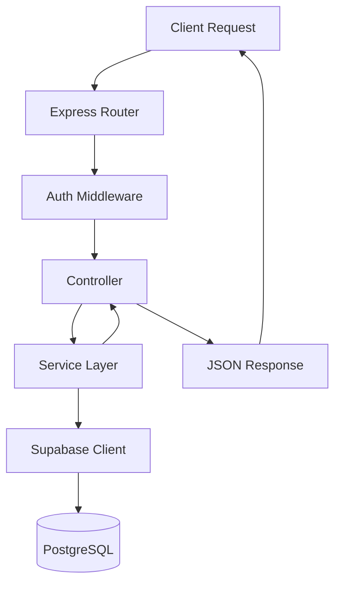

## Request Flow

### Authentication Flow

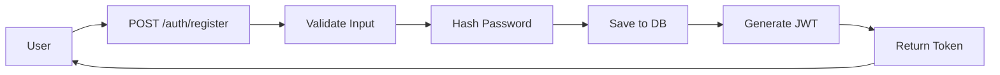

### Product Browsing Flow

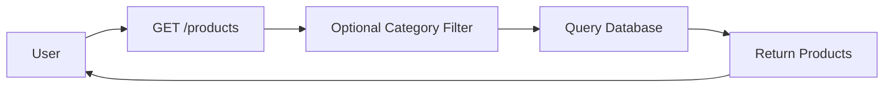

### Shopping Cart Flow

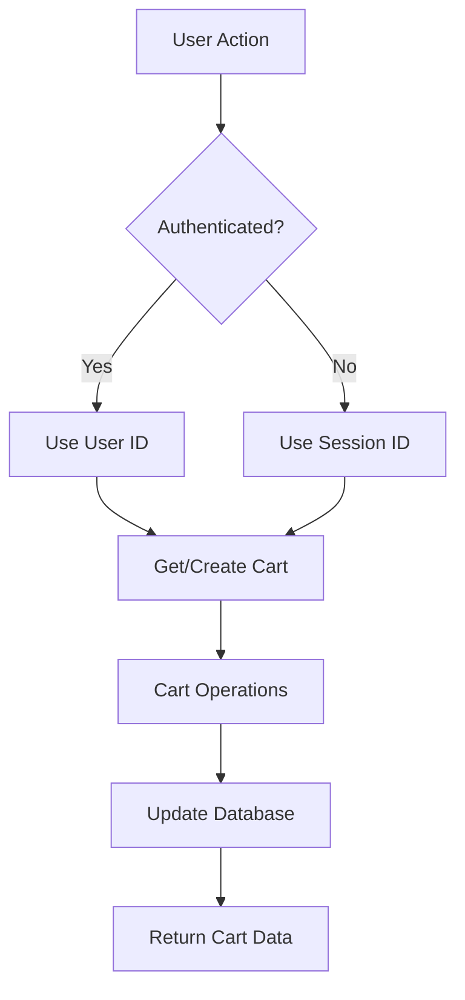

### Order Creation Flow

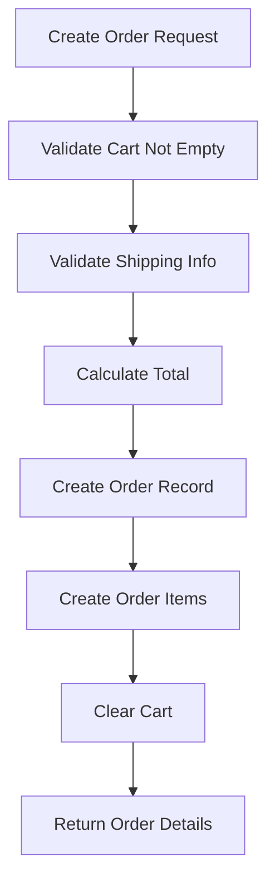

## Database Schema

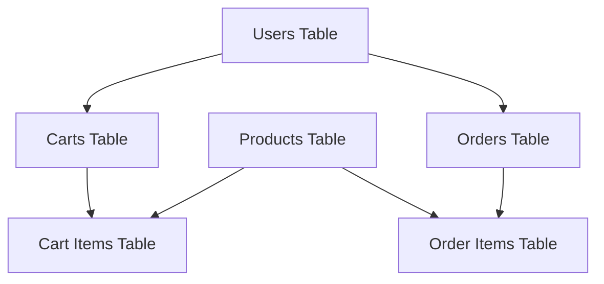

## Technology Stack

### Frontend
- React 18
- TypeScript
- Vite
- TailwindCSS
- Shadcn/ui Components
- React Router
- React Query (optional)

### Backend
- Node.js
- Express.js
- TypeScript
- Supabase Client
- JWT
- Bcrypt
- Zod

### Database
- PostgreSQL (via Supabase)
- Row Level Security
- Automatic Backups
- Real-time subscriptions (available)

## API Endpoints Structure

```
/api
├── /auth
│   ├── POST /register
│   ├── POST /login
│   └── GET /profile
├── /products
│   ├── GET /
│   ├── GET /:id
│   ├── GET /categories
│   └── GET /search
├── /cart
│   ├── GET /
│   ├── POST /add
│   ├── PUT /update
│   └── DELETE /:productId
└── /orders
    ├── POST /
    ├── GET /
    └── GET /:id
```

## Security Layers

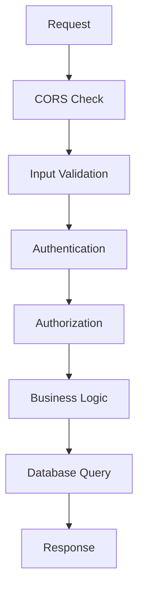

## Deployment Architecture

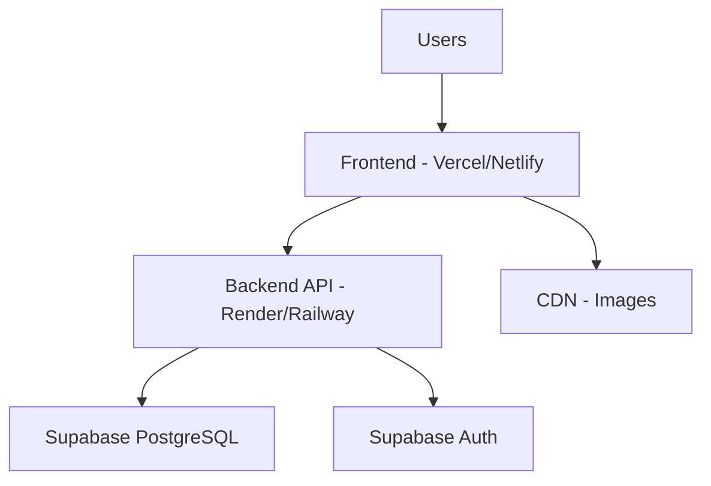

## Data Flow Example: Adding to Cart

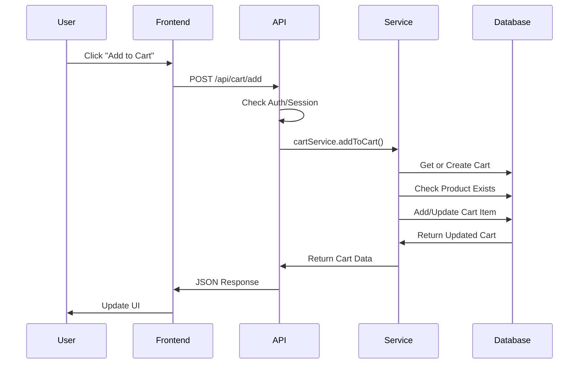

## Authentication Flow Detail

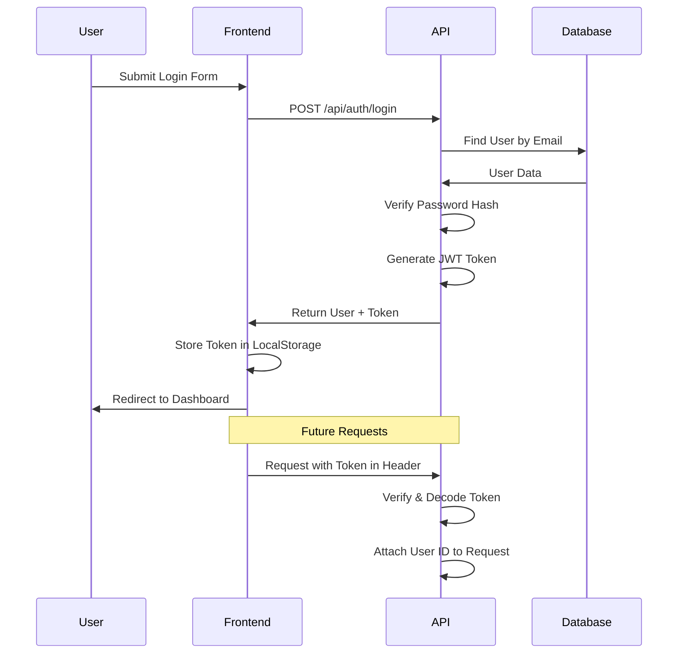

## Error Handling Flow

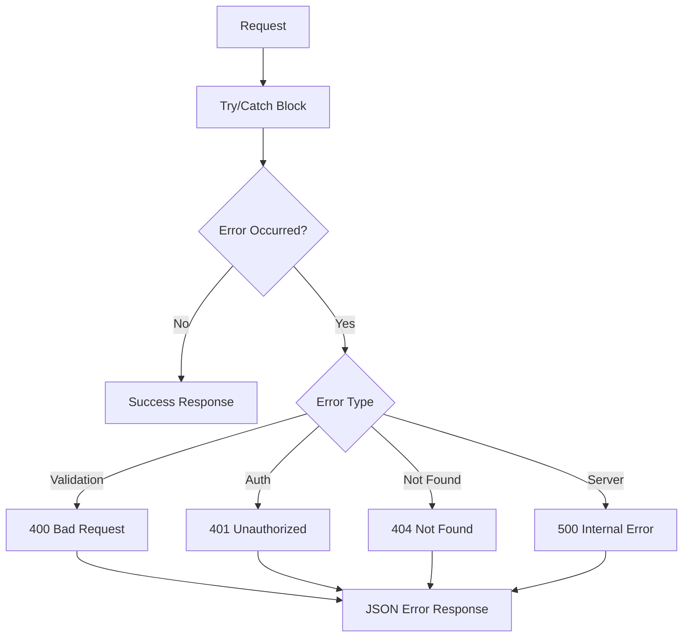

## Scalability Considerations

### Current Setup (MVP)
- Single server instance
- Supabase shared database
- Suitable for: 0-10,000 users

### Future Scaling Options
1. **Horizontal Scaling**
   - Load balancer
   - Multiple API instances
   - Redis for session storage

2. **Database Optimization**
   - Connection pooling
   - Read replicas
   - Caching layer (Redis)

3. **CDN & Assets**
   - Cloudflare/CloudFront
   - Image optimization
   - Static asset caching

4. **Microservices (if needed)**
   - Separate auth service
   - Separate payment service
   - Message queue for async tasks

## Development vs Production

### Development
- Local database (optional)
- Hot reload
- Detailed error messages
- CORS: `localhost:5173`

### Production
- Supabase production instance
- Compiled JavaScript
- Generic error messages
- CORS: Production domain only
- HTTPS enforced
- Environment variables secured

## Best Practices Implemented

✅ Separation of Concerns (MVC pattern)
✅ Service Layer for business logic
✅ Type safety with TypeScript
✅ Input validation with Zod
✅ Prepared statements (SQL injection prevention)
✅ Password hashing
✅ JWT authentication
✅ Error handling middleware
✅ Environment-based configuration
✅ Database indexes for performance
✅ CORS configuration
✅ RESTful API design

## Future Enhancements

### Phase 2
- [ ] Payment integration (Stripe)
- [ ] Email notifications
- [ ] Order status tracking
- [ ] Product reviews
- [ ] Wishlist functionality

### Phase 3
- [ ] Admin dashboard
- [ ] Inventory management
- [ ] Analytics & reporting
- [ ] Multi-currency support
- [ ] Internationalization

### Phase 4
- [ ] Mobile app
- [ ] Advanced search (Elasticsearch)
- [ ] Recommendation engine
- [ ] Real-time notifications
- [ ] Social features
